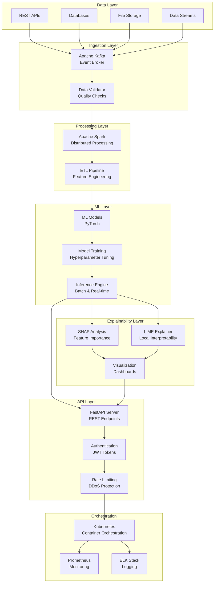
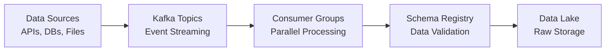
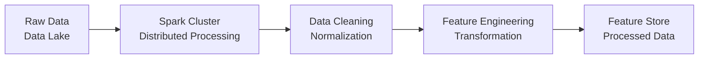
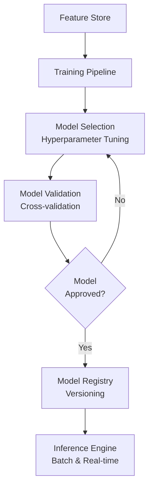
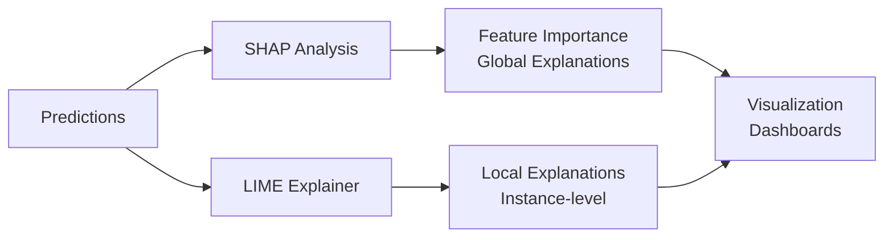
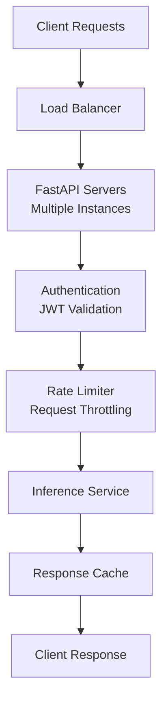
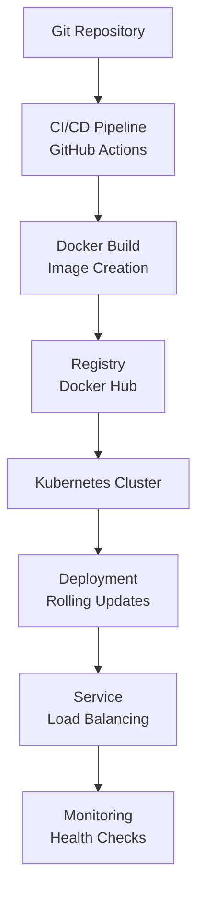
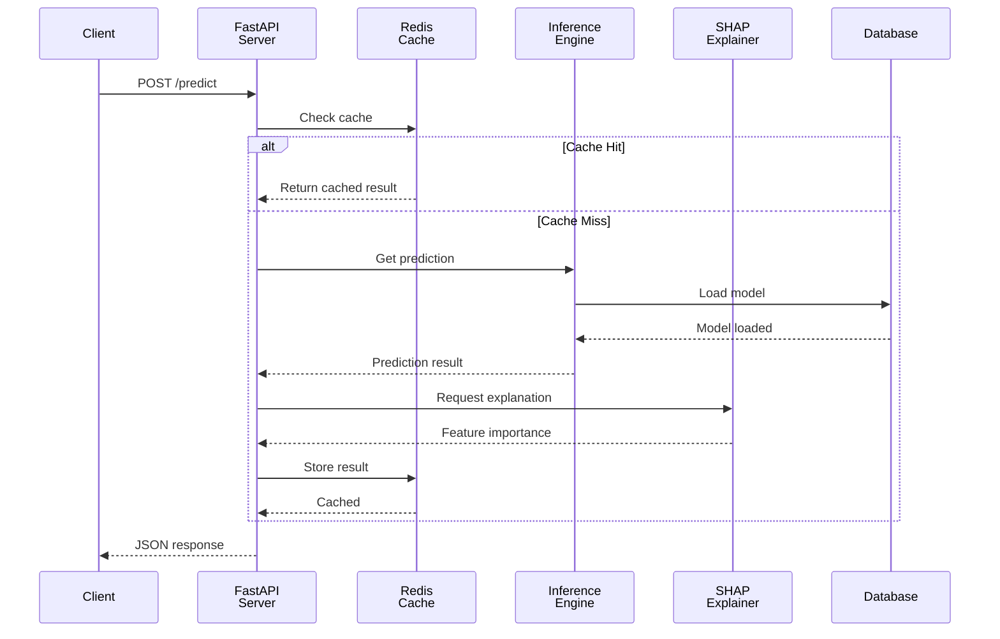
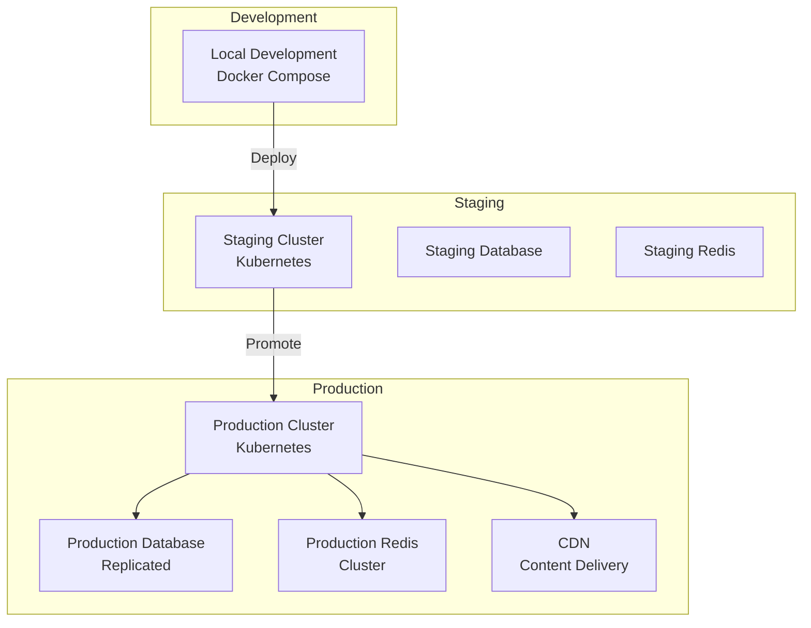
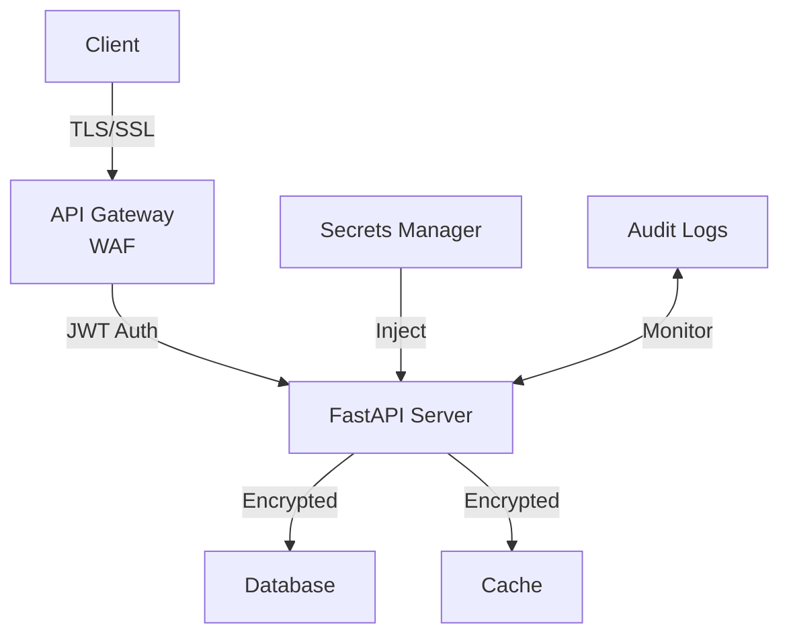

# FastTrack AI - System Architecture & Design

## High-Level System Overview

## Component Architecture

### 1. Data Ingestion Pipeline

**Responsibilities:**
- Continuous data ingestion from multiple sources
- Schema validation and data quality checks
- Event deduplication and ordering guarantees
- Exactly-once delivery semantics

### 2. Data Processing Layer

**Responsibilities:**
- Distributed data processing at scale
- Feature engineering and transformation
- Data aggregation and windowing
- Quality metrics and monitoring

### 3. Model Training & Inference

**Responsibilities:**
- Advanced model architectures (Transformers, LSTMs)
- Automated hyperparameter optimization
- Model versioning and registry
- A/B testing and canary deployments

### 4. Explainability & Interpretability

**Responsibilities:**
- Feature importance analysis
- Local instance explanations
- Prediction confidence metrics
- Interactive visualizations

### 5. API & Service Layer

**Responsibilities:**
- RESTful API endpoints
- Request validation and sanitization
- Response caching
- Error handling and logging

### 6. Deployment & Orchestration

**Responsibilities:**
- Containerization with Docker
- Kubernetes orchestration
- Auto-scaling and load balancing
- Health checks and self-healing

## Data Flow Diagram

## Deployment Architecture

## Technology Stack Decision Matrix

| Component | Technology | Rationale |
|-----------|-----------|-----------|
| **ML Framework** | PyTorch | Dynamic computation graphs, strong community, production-ready |
| **Data Processing** | Apache Spark | Distributed processing, fault-tolerance, SQL support |
| **Streaming** | Apache Kafka | High throughput, durability, exactly-once semantics |
| **API** | FastAPI | Async support, automatic OpenAPI docs, high performance |
| **Explainability** | SHAP + LIME | Industry standard, interpretable, complementary approaches |
| **Containerization** | Docker | Consistency, reproducibility, industry standard |
| **Orchestration** | Kubernetes | Auto-scaling, self-healing, multi-cloud support |
| **Monitoring** | Prometheus + Grafana | Open-source, scalable, rich ecosystem |
| **Database** | PostgreSQL | ACID compliance, JSON support, reliability |
| **Caching** | Redis | In-memory speed, data structures, pub/sub |

## Scalability Considerations

### Horizontal Scaling
- **API Servers:** Kubernetes auto-scaling based on CPU/memory
- **Spark Cluster:** Dynamic executor allocation
- **Kafka:** Partition-based parallelism
- **Database:** Read replicas and sharding

### Vertical Scaling
- **GPU Support:** NVIDIA GPU acceleration for inference
- **Memory Optimization:** Model quantization and pruning
- **Network:** High-bandwidth interconnects

## Security Architecture

**Security Measures:**
- TLS/SSL encryption in transit
- JWT token-based authentication
- Role-based access control (RBAC)
- Secrets management (environment variables, vaults)
- Comprehensive audit logging
- DDoS protection via rate limiting
- Input validation and sanitization

## Disaster Recovery & High Availability

- **Database Replication:** Multi-region replication
- **Backup Strategy:** Daily snapshots, point-in-time recovery
- **Failover:** Automatic failover to standby instances
- **Load Balancing:** Multi-zone deployment
- **Health Checks:** Continuous monitoring and alerting

---

*Last Updated: December 2025*
